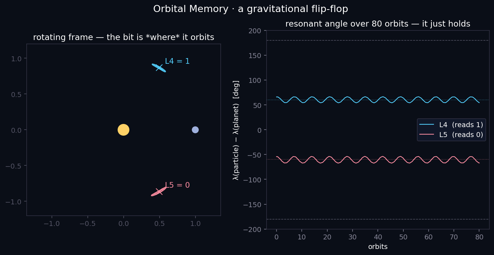

# Orbital Memory

**A nonvolatile memory bit made of gravity — one that holds its value the way Jupiter's Trojan asteroids have held their positions for 4.5 billion years.**

Where its sibling project [slingshot-computing](https://github.com/sjqtentacles/slingshot-computing) does *logic* with transient gravitational flybys — and is fundamentally memoryless — this one does the other half of a computer: **storage**. A bit is stored as *which stable island a body orbits in*. It's persistent, self-protecting, and requires no forces but `F = Gm₁m₂/r²`.

<p align="center">
  
</p>

<p align="center"><em>An inclined Trojan bit in 3D: the particle librates at a Lagrange corner (that's the bit) while bobbing through the orbital plane once per orbit.</em></p>

---

## The idea

In the circular restricted three-body problem — a heavy **primary**, a **secondary**, and a massless **test body** — there are two triangular equilibrium points, **L4** (60° ahead of the secondary) and **L5** (60° behind). A body near one of them doesn't fall in or drift away; it *librates* in a stable "tadpole" orbit around it. The two islands are separated by a **separatrix**, so a small nudge can't move the body from one to the other.

That's a bit:

- librating around **L4** → reads **1**
- librating around **L5** → reads **0**

**This is moon-scale hardware, not a toy.** Saturn's little moons **Telesto** and **Calypso** ride in the L4/L5 points of **Tethys**, and **Helene** and **Polydeuces** in those of **Dione** — real co-orbital moons that *are* this exact cell, holding their "bit" over the age of the solar system. The dynamics depend only on the mass ratio `μ`, so the same code covers star+planet, planet+moon, and moon+co-orbital-moonlet; only the libration timescale (`~1/√μ`) changes.

<p align="center">
  
</p>

<p align="center"><em>The noise margin, as motion: the bit holds, until a kick past the separatrix erases it.</em></p>

## What the demo shows

```
python -m demos.flipflop_demo
```

**1 · It holds.** Both states librate steadily around ±60° for 80 orbits at an energy drift of `3e-11`. This is the thing flyby logic fundamentally cannot do — retain state. Nature's version (Jupiter's Trojans) has held for ~4.5 Gyr.

**2 · It has a noise margin.** Kicks below **~3.5% of the orbital speed** leave the bit intact (just a wider libration); above it, the particle crosses the separatrix and is ejected — erased. A real, quantifiable memory margin.

<p align="center">
  
</p>

## The physics finding

The memory is protected **topologically, not dissipatively.** L4/L5 are extrema of the effective potential, stable only because of the velocity-dependent Coriolis force. Add friction and you kill that stabilization: **drag destabilizes the Lagrange points** (verified in code). So there's no attractor pulling the bit back to a clean value; instead the bit is held by the *geometry of phase space* — an invariant island bounded by a separatrix, the KAM / Nekhoroshev way. Refresh isn't damping; it's the topology.

### The conserved quantity

The rigorous backbone is the **Jacobi constant** `C_J` — the rotating-frame analogue of energy, and the one conserved quantity of this problem. `orbital/theory.py` computes it, and the test suite pins the memory to it:

- a **held** bit sits at `C_J ≈ C_L4 = 3 − μ(1−μ)` (the exact triangular value; sim matches to ~1e-4) and conserves it to **~1e-12**;
- **writing energy** into the cell (a kick) *lowers* `C_J`; push it past the separatrix and the tadpole becomes a horseshoe — the bit erases.

So the noise margin isn't just an empirical 3.5% — it's a statement about `C_J` crossing the separatrix value, and it's tested as such.

A consequence: **writing** (flipping 0↔1) is genuinely subtle — you can't just drag a particle into the island, because drag repels it. Real Trojan capture happens through slow orbital migration and adiabatic resonance capture (Henrard, Neishtadt). That's the honest frontier of this project, and the natural place for a proper Hamiltonian-theory pass.

## 3D

The dynamics generalize cleanly: `orbital/nbody.py` infers its dimension from the bodies, so the same integrator runs the flat bit and an **inclined** Trojan (`demos/flipflop_3d.py`), which holds the L4/L5 bit in-plane *and* oscillates ±0.16 through the orbital plane once per orbit — real out-of-plane motion, drift `1.8e-11`. The rotating-camera GIF at the top is that, not a projected 2D scene.

## Run it

```bash
pip install -r requirements.txt

python -m demos.flipflop_demo   # HOLD + NOISE MARGIN, writes out/flipflop.{png,json}
python -m demos.flipflop_3d     # inclined Trojan, writes docs/orbital_3d.gif
python -m demos.make_gifs       # the 2D hold->erase gif
python -m pytest                # 37-test suite
```

## Tests

A TDD suite (`python -m pytest`, 37 tests) checks the integrator against
closed-form physics, not just against itself:

- **Kepler** — a light moon on a circular orbit stays circular and obeys
  Kepler's third law (period = `2π√(a³/GM)`).
- **Conservation** — energy (`< 1e-9`) and momentum in 2D and 3D; the
  barycenter stays pinned at the origin (the readout depends on it).
- **Lagrange theory** — L4/L5 form an exact equilateral triangle and are true
  equilibria; the measured tadpole libration period matches
  `2π/√(27/4·μ)` to within a few percent; the bit holds across mass ratios.
- **Jacobi constant** — conserved to `< 1e-9` along held and erased orbits; a
  held bit matches the analytic `C_L4 = 3 − μ(1−μ)`; L4 and L5 share it; and a
  bit-erasing kick provably lowers `C_J` below the held value.
- **Memory** — both states read correctly and hold for 80 (and, slow, 300)
  orbits without secular drift; sub-threshold kicks preserve the bit and
  super-threshold kicks erase it; the 3D cell holds its bit while bobbing out
  of plane; a 2-vector kick on a 3D cell leaves `vz` intact (regression).
- **Determinism & 2D/3D consistency** — repeatable runs; a 3D run with `z=0`
  reproduces the 2D run exactly.

## Layout

```
orbital/    nbody.py (2D/3D integrator, G=1) · memory.py (L4/L5 cell, readout, kicks)
demos/      flipflop_demo.py · flipflop_3d.py · make_gifs.py
tests/      test_nbody.py · test_memory.py · test_theory.py  (37 tests, physics-validated)
docs/       the figures and GIFs above
```

## Physics & numerics

- Circular restricted three-body problem, `G = 1`, total mass 1, separation 1,
  mean motion `n = 1` (period `2π`). Planet mass fraction `μ = 0.003` (`< 0.0385`,
  so L4/L5 are linearly stable).
- Adaptive high-order Runge–Kutta (scipy `DOP853`, `rtol ~ 1e-11`); energy drift
  ~`1e-11` over the runs. A symplectic integrator (e.g. REBOUND's WHFast) is the
  right upgrade for retention claims over astronomical timescales.

## Honest caveats & prior art

- The stored bit rides on real, well-studied physics: triangular Lagrange
  stability (Gascheau/Routh), tadpole vs horseshoe libration, resonance capture
  (Malhotra; Neptune capturing Pluto into 3:2), KAM/Nekhoroshev stability of
  invariant tori. What appears unclaimed — as with the slingshot project — is
  engineering it into a *built memory artifact* with a read, a noise margin, and
  a route to a write. The novelty is the construction, not the mechanism.
- Turing-completeness is not claimed. This is a memory element; pairing it with
  slingshot-computing's gates (flyby = write head, orbit = storage) is the
  longer arc.

## Roadmap

- [x] A bit that holds: L4/L5 tadpole memory, read + retention (80 orbits, 3e-11)
- [x] Noise margin: the separatrix threshold (~3.5% of orbital speed)
- [x] 3D: dimension-agnostic integrator + inclined-Trojan visualization
- [x] Finding: the memory is topological, not dissipative (drag destabilizes L4/L5)
- [x] TDD suite (37 tests) validating the integrator against closed-form physics
- [ ] Write: adiabatic resonance capture (migration-driven), not drag
- [ ] Theory pass: averaged Trojan Hamiltonian → closed-form noise margin & retention
- [ ] A multi-cell "byte"; the inclination bob as an analog sub-register
- [ ] Symplectic integrator for astronomical-timescale retention
