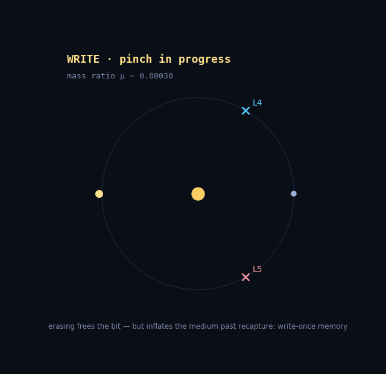

# Orbital Memory

[](https://github.com/sjqtentacles/orbital-memory/actions/workflows/tests.yml)

**A nonvolatile memory cell made of gravity — write, cool, hold, read, erase, and a flyby-driven erase head — storing its bit the way Jupiter's Trojans and Saturn's co-orbital moons store theirs.**

Where its sibling project [slingshot-computing](https://github.com/sjqtentacles/slingshot-computing) does *logic* with transient gravitational flybys — and is fundamentally memoryless — this one is the other half of a computer: **storage**. A bit is stored as *which stable island a moonlet orbits in*. Nothing acts but `F = Gm₁m₂/r²` — the one non-gravitational term in the engine is an optional drag switch that exists *solely to prove that dissipation destroys this memory*.

<p align="center">
  
</p>

<p align="center"><em><b>Writing a bit by growing a planet.</b> The blank medium is a horseshoe moonlet; a slow mass-growth pulse pinches it into L4 (bit 1) or L5 (bit 0) — selected purely by pulse <b>timing</b>. This is the mechanism by which a growing Jupiter captured its Trojans.</em></p>

---

## The full memory cycle

| Operation | Mechanism | Physics |
|---|---|---|
| **HOLD** | tadpole libration around L4/L5 | topological protection (invariant island, KAM) |
| **WRITE** | grow the secondary's mass — the horseshoe pinch | adiabatic capture (Henrard, Neishtadt) |
| **COOL** | tangential station-keeping burns | co-orbital pendulum damping (and it write-protects) |
| **READ** | which side the resonant angle librates on | the separatrix-crossing classifier |
| **ERASE** | shrink the mass back (release), or any kick past the noise margin | separatrix release / crossing |
| **GATE** | an aimed massive flyby erases the bit conditionally | logic acting on memory — the capstone |

- librating around **L4** (60° ahead of the secondary) → reads **1**
- librating around **L5** (60° behind) → reads **0**
- horseshoe / circulation → **erased / blank**

**This is moon-scale hardware.** Saturn's moons **Telesto** and **Calypso** ride Tethys's L4/L5, **Helene** and **Polydeuces** ride Dione's, and **Janus & Epimetheus** live on the horseshoe orbits our blank medium uses. The dynamics depend only on the mass ratio `μ`, so the same code covers star+planet, planet+moon, and moon+moonlet.

## The states of the medium

<p align="center">
  
</p>

## The write: timing is the data

Same blank horseshoe, same growth pulse — only the **firing time** differs. The moonlet alternates sides of the ring as it runs its horseshoe; the pinch captures it into whichever island it is transiting when the growing tadpole band engulfs its orbit:

<p align="center">
  
</p>

Why it must be this way — three write mechanisms, two of which provably fail:

1. **Impulsive kicks cannot write.** A conservative kick moves the state along the energy surface; measured, every super-threshold kick scatters the moonlet out of the resonance. Kicks only erase.
2. **Dissipation cannot write.** L4/L5 are Coriolis-stabilized potential extrema — drag *destabilizes* them (verified in code). There is no attractor to relax into.
3. **A slow parameter change can.** Adiabatic capture needs no aim, only timing — robustness is the adiabatic theorem's gift. The write pulse is `μ(t)`: mass transferred from primary to secondary at fixed total, so the circular kinematics stay exact throughout.

The written bit then **survives an engine swap**: written in the fast rotating-frame integrator, each bit is handed to the full inertial N-body integrator and held for 40 more orbits (test-enforced).

## Cooling: deep bits, and free write-protection

A pinch-written bit librates wide (~±70° — it inherits the horseshoe's phase-space
area, and adiabatic processes cannot shed area). `orbital/cool.py` shrinks it the way
real co-orbital missions would: **tangential station-keeping burns**. The tadpole is a
slow pendulum whose momentum is the radial offset `da = r − 1`; burns at mid-swing,
each capped at `0.008` (the erase threshold is `0.035`), damp it — **three burns take
±66° to ~24°**:

<p align="center">
  
</p>

Getting here took three wrong schemes, kept in the module docstring as physics
documentation (retro-kicks eject through the L1 neck; 'raise C_J' is exactly
backwards and is impulsive drag; blind prograde kicks fall out the bottom of the
band). Two lessons survived: **C_J stratifies but does not classify** (a cooled,
slightly eccentric deep tadpole sits *below* C_L4 while erased orbits sit nearby),
and — the punchline — **cooling write-protects**: a cooled bit's area is too small
for the erase pulse to release. Cold storage is locked storage (test-enforced).

## Erase — and the rewrite wall

Shrinking μ back to blank (the write pulse reversed) **releases** the bit into a
bounded, bit-less horseshoe. Erase works. Rewriting after it does not — and that
negative result is measured, pinned by tests, and worth more than a demo:

<p align="center">
  
</p>

- **Release inflates the medium**: captured at `da = 0.030`, released at `~0.07`
  (the separatrix-crossing invariant jump).
- **Recapture has a ceiling**: the tadpole band can never outrun the Hill radius
  (`W/r_H = 2.35 μ^(1/6) < 1` across the whole range), so offsets beyond `~0.045`
  cannot be re-pinched by *any* μ pulse. Every scanned second-write delay reads
  erased.
- **Every fix fails**: burns that cool a tadpole *pump* a horseshoe (the L3
  separatrix layer is sticky), drag destabilizes outright, and a 3×-slower
  "gentler" erase leaves the moonlet lingering in the separatrix layer until it is
  **ejected entirely**.

At this design point the cell is **write-once / erase-once**: erasing the bit
trashes the medium beyond recapture — an erasure-cost statement with a distinctly
Landauer flavor. A rewritable cell needs a release channel that beats the
inflation; that is the roadmap's open problem.

## The capstone: logic acts on memory

The unification of the two projects. slingshot-computing's mechanism — an aimed
flyby, its launch direction root-found on the full simulation — pointed at this
project's stored bit. A massive bullet (`m = 2e-4`) on a fast hyperbolic pass is
aimed to shave the moonlet at closest approach `0.002`:

<p align="center">
  
</p>

**Bullet present → bit erased. Bullet absent → bit survives. A graze at 25× the
distance → bit survives** (locality: the datum a dual-rail *write* head would build
on). The bullet's presence is a logic input; the stored bit is the register.

Two findings run the implementation: the **guiding center stores the bit, and only
tangential impulse moves it** (a radial pass at miss 0.004 pumps a monster epicycle
yet leaves the bit readable; erasure needs the deep pass where the tangential share
beats the threshold), and a massive intruder **drags the system barycenter**, so
readout uses a COM-corrected resonant angle — a test proves the correction matters.

## The energy landscape

<p align="center">
  
</p>

The rigorous backbone is the **Jacobi constant** `C_J` — the one conserved quantity of the circular restricted three-body problem. A held bit sits at the exact triangular value `C_L4 = 3 − μ(1−μ)` (sim matches to 2e-4 and conserves `C_J` to 1e-10, both test-enforced; measured drift is ~1e-12); writing energy in (a kick) lowers `C_J` toward the separatrix; past it, the bit erases. The noise margin — kicks below `memory.ERASE_KICK` = **3.5% of orbital speed** — is a named constant, a statement about `C_J`, and tested at both sides of the threshold. And because the moonlet is massless, `C_J` — not the system energy, which only sees the massive bodies — is the correct accuracy metric for the cell; the tests are anchored to it.

<p align="center">
  
</p>

## 3D

`orbital/nbody.py` infers its dimension from the bodies, so the same integrator runs the flat cell and an **inclined** Trojan (`demos/flipflop_3d.py`) that holds its bit while bobbing ±0.16 through the orbital plane once per orbit — genuinely three-dimensional storage, with the full 3D Jacobi integral conserved to 1e-9 (test-enforced):

<p align="center">
  
</p>

## Run it

```bash
pip install -r requirements.txt

python -m demos.flipflop_demo    # HOLD + NOISE MARGIN (+ Jacobi readout)
python -m demos.write_demo       # WRITE: timing diagram + the write gif
python -m demos.landscape        # the energy-landscape & anatomy figures
python -m demos.flipflop_3d      # the inclined-Trojan 3D gif
python -m demos.make_gifs        # the 2D hold->erase gif
python -m pytest                 # 51-test suite
```

## Tests (TDD, physics-validated)

100 tests check the simulation against closed-form theory, not just against itself:

- **Kepler** — a moon on a circular orbit stays circular and obeys Kepler's third law.
- **Conservation** — energy `<1e-9` and momentum in 2D & 3D; barycenter pinned; the massless moonlet exerts no back-reaction; time-reversal retraces.
- **Lagrange theory** — L4/L5 exactly equilateral and true equilibria; measured libration period matches `2π/√(27/4·μ)`; stability across mass ratios.
- **Jacobi constant** — conserved along held *and* erased orbits; held bit sits at analytic `C_L4`; erasing kicks provably lower `C_J`.
- **Rotating engine** — matches the inertial integrator trajectory-for-trajectory; blank medium circulates at the theoretical drift rate.
- **WRITE** — same blank + same pulse, timing alone selects the bit; both bits write correctly, deterministically, and survive a 40-orbit hold after an engine swap to the full N-body integrator.
- **Memory** — holds 80 (and 300, slow-marked) orbits with no secular drift; sub-threshold kicks preserve, super-threshold erase (the named `ERASE_KICK` tested on both sides); the separatrix-crossing reader classifies tadpole/horseshoe/circulation physically, wide tadpoles included; drag destabilization is a committed test, not an anecdote.
- **COOL** — three burns shrink ±66°→<35° with the value preserved; burns bounded ≪ threshold; cooled bits survive the honest engine; deterministic.
- **ERASE / the wall** — release restores a bounded blank at a pinned inflated offset; the recapture ceiling asserted analytically; no scanned delay recaptures (slow); slower erase ejects (slow); the erase pulse cannot release a cooled bit (write-protection, slow).
- **GATE** — aim converges to the requested miss; present erases / absent survives / 25× graze survives; the cell hardware rides out the shot; COM-corrected readout provably differs from the naive one; close-encounter numerics bounded explicitly.

## Layout

```
orbital/    nbody.py (2D/3D inertial) · rotating.py (co-rotating frame, μ(t), schedules)
            memory.py (cell, reader, kicks) · write.py (the pinch) · cool.py (burns)
            rewrite.py (erase + the wall) · gate.py (the bullet) · theory.py (C_J, L-points)
demos/      flipflop_demo · write_demo · cool_demo · rewrite_demo · gate_demo
            landscape · flipflop_3d · make_gifs · style.py (shared visual system)
tests/      100 tests: physics invariants, every operation, every pinned finding
docs/       all figures and GIFs above
```

## Physics & numerics

- Circular restricted three-body problem, `G = 1`, total mass 1, separation 1, mean motion `n = 1`. Cell mass ratio `μ = 0.003` (< 0.0385 Gascheau/Routh limit); blank medium at `μ₀ = 3e-4`.
- Adaptive high-order Runge–Kutta (scipy `DOP853`); energy drift ~`1e-11`, Jacobi drift ~`1e-12` on held cells. A symplectic integrator (e.g. REBOUND's WHFast) is the right upgrade for Gyr-scale retention claims.

## Honest caveats & prior art

- Every mechanism here is textbook celestial mechanics: triangular Lagrange stability (Gascheau/Routh), tadpole/horseshoe co-orbitals (Janus & Epimetheus), adiabatic resonance capture (Henrard; Neishtadt; Malhotra — Neptune capturing Pluto), zero-velocity curves and the Jacobi integral. What appears unclaimed is the *construction*: engineering these into a memory cell with a write pulse, a timing diagram, a noise margin, and a test suite. The novelty is the artifact, not the mechanism.
- Wide pinch-written tadpoles librate broadly (~±70°); they hold and read robustly, but deep-cooling a written bit (shrinking its libration) needs a non-adiabatic trick — an open problem, alongside a genuine erase-to-blank cycle (write is currently one-way: μ stays grown).
- Turing-completeness is not claimed. This is a memory element; pairing it with slingshot-computing's flyby gates (flyby = logic, orbit = storage) is the longer arc.

## Roadmap

- [x] A bit that holds: L4/L5 tadpole memory (80–300 orbits, no drift)
- [x] Noise margin: `ERASE_KICK` = 3.5% of orbital speed, tested both sides
- [x] 3D: dimension-agnostic integrator + inclined-Trojan bit (full 3D Jacobi integral)
- [x] Finding: memory is topological, not dissipative (drag destabilizes L4/L5 — tested)
- [x] **WRITE: adiabatic horseshoe pinch — bit selected by pulse timing alone**
- [x] **COOL: station-keeping burns (±66°→24°) — and cooling write-protects**
- [x] **ERASE: μ-release restores a blank; finding: the REWRITE WALL (write-once memory)**
- [x] **GATE: conditional erase by aimed flyby — logic acts on memory (the capstone)**
- [x] CI; 100-test physics-validated suite; findings pinned as tests
- [ ] Dual-rail write head: two moonlets, a routed bullet erases one — the surviving rail IS the written bit (locality datum already tested)
- [ ] A release channel that beats the erase-inflation (true rewritability)
- [ ] Averaged 1-DOF Hamiltonian: closed-form noise margin & write windows
- [ ] A register: several cells at different radii; crosstalk vs spacing
- [ ] Symplectic integrator for astronomical-timescale retention
