# Orbital Memory

[](https://github.com/sjqtentacles/orbital-memory/actions/workflows/tests.yml)

**A long-lived (but metastable) memory cell made of gravity — written by orbit insertion, held by nothing but `F = Gm₁m₂/r²`, read by watching an angle, and rewritten by a real gravitational flyby — storing its bit the way Jupiter's ~13,000 Trojan asteroids store theirs.** No fake actuators: every operation maps to something that actually happens in space, the noise margin and libration period now come from a closed-form Hamiltonian, and the simulation is validated against the real sky.

Where its sibling project [slingshot-computing](https://github.com/sjqtentacles/slingshot-computing) does *logic* with transient gravitational flybys — and is fundamentally memoryless — this one is the other half of a computer: **storage**. A bit is stored as *which stable island a body librates in* — L4 (leading) or L5 (trailing).

<p align="center">
  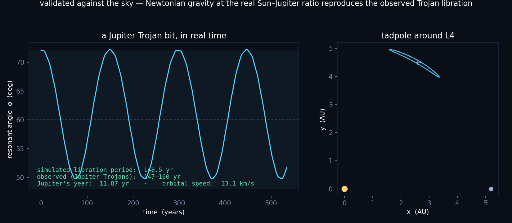
</p>

<p align="center"><em><b>Validated against the sky.</b> Run the cell at the real Sun–Jupiter mass ratio and convert the clock to years: the simulated bit librates with a <b>~148-year period</b> — the period actually observed for Jupiter's Trojans. Nothing is fit to that number; it falls out of Newtonian gravity at the real ratio.</em></p>

---

## Is this real? — the honest boundary

An earlier version of this project wrote and erased bits by *growing and shrinking the planet's mass*. That was the one fake part — planets don't do that on command — and it's gone. Every operation now maps to a real space mechanism:

| Operation | Realistic mechanism | Real-world analog |
|---|---|---|
| **WRITE** | orbit **insertion** — deliver the body, one insertion burn (Δv) drops it onto the tadpole | stationing a spacecraft at L4/L5; natural Trojan capture |
| **HOLD** | pure gravity, no forces added | deep bits ~Gyr; typical Trojans metastable, 10 kyr–100 Myr |
| **READ** | measure the libration angle | astrometry |
| **COOL** | **station-keeping** burns, a few m/s of Δv | how real co-orbital spacecraft would hold station |
| **REWRITE** | **erase by flyby, then re-insert** — both halves real | co-orbitals really are scattered and re-injected by encounters |
| **ERASE** | an aimed massive **flyby** scatters the bit out of resonance | gravitational scattering |

The simulation is honest Newtonian *n*-body throughout (scipy `DOP853`, no softening), validated against the observed Jupiter-Trojan libration period, Jupiter's real orbital speed (13.06 km/s), and its real year (11.87 yr). **The one remaining caveat is the obvious one: nobody is going to build a memory device out of asteroids.** It is a faithful simulation of real orbital dynamics and a physics/art project — not a product. The physics is real; the application is a conceit, and it says so.

## The full memory cycle

| Operation | Mechanism | Physics |
|---|---|---|
| **HOLD** | tadpole libration around L4/L5 | topological protection (invariant island, KAM) |
| **WRITE** | orbit insertion — one burn onto the tadpole | targeting / orbit insertion (Δv reported in m/s) |
| **COOL** | tangential station-keeping burns | co-orbital pendulum damping |
| **READ** | which side the resonant angle librates on | the separatrix-crossing classifier |
| **REWRITE** | erase-by-flyby, then re-insert | gravitational scattering + insertion |
| **ERASE** | an aimed massive flyby scatters the bit out | separatrix crossing / logic acting on memory |

- librating around **L4** (60° ahead of the secondary) → reads **1**
- librating around **L5** (60° behind) → reads **0**
- horseshoe / circulation → **erased / blank**

**This is moon-scale hardware too.** Saturn's moons **Telesto** and **Calypso** ride Tethys's L4/L5, **Helene** and **Polydeuces** ride Dione's, and **Janus & Epimetheus** live on the horseshoe orbits the blank medium uses. The dynamics depend only on the mass ratio `μ`, so the same code covers star+planet, planet+moon, and moon+moonlet.

## The real swarm

Real Jupiter carries two clouds of Trojans — the **Greeks** leading at L4, the **Trojans** trailing at L5. Seed a cloud of massless particles at the real ratio and advance them together, and the same two lobes appear:

<p align="center">
  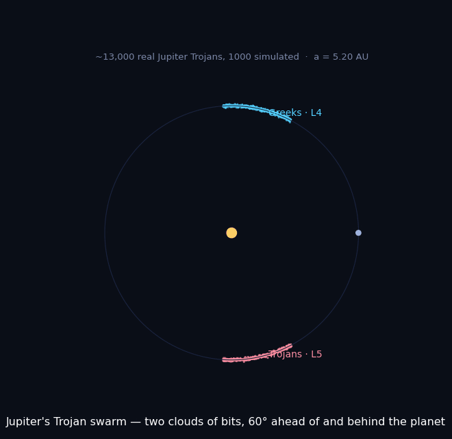
</p>

## WRITE: placing a bit

Writing is *delivering the body into the chosen island* — exactly how you would station a spacecraft at L4/L5. The body arrives on a co-orbital transfer (on which, coasting, it is **not** a bit — it reads erased) and a single **insertion burn** captures it onto the tadpole; the cost is a real, *actually-applied* Δv (~510 m/s for a deep L4 bit at the Sun–Jupiter scale):

<p align="center">
  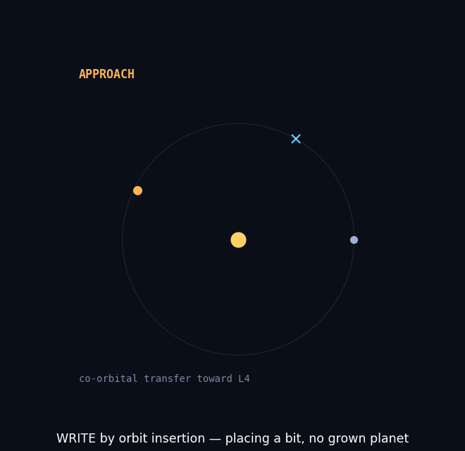
</p>

Insertion into L4 writes **1**, into L5 writes **0**. No planet is grown; the burn is a genuine velocity change (`dv = |v_written − v_arrival|`, test-enforced), and it is *load-bearing* — the same body without the burn coasts off the island and reads erased.

## The phase portrait — why a bit is a bit

The stored bit is a slow pendulum whose coordinate is the resonant angle `φ` and whose momentum is the radial offset `da = r − 1`. The two tadpole islands (around L4 and L5) are the two memory states; the **separatrix** between them is why a small perturbation can't flip the bit:

<p align="center">
  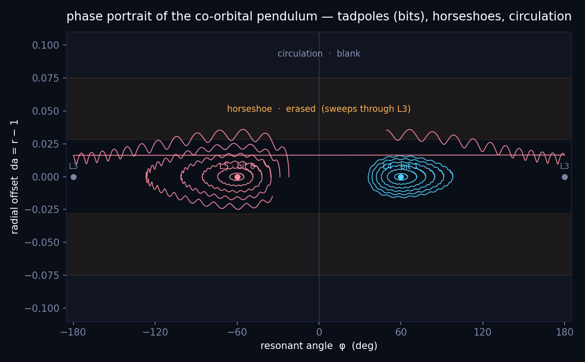
</p>

The same four families, drawn as orbits in the rotating frame — two tadpole bits, the horseshoe (erased), and free circulation (blank):

<p align="center">
  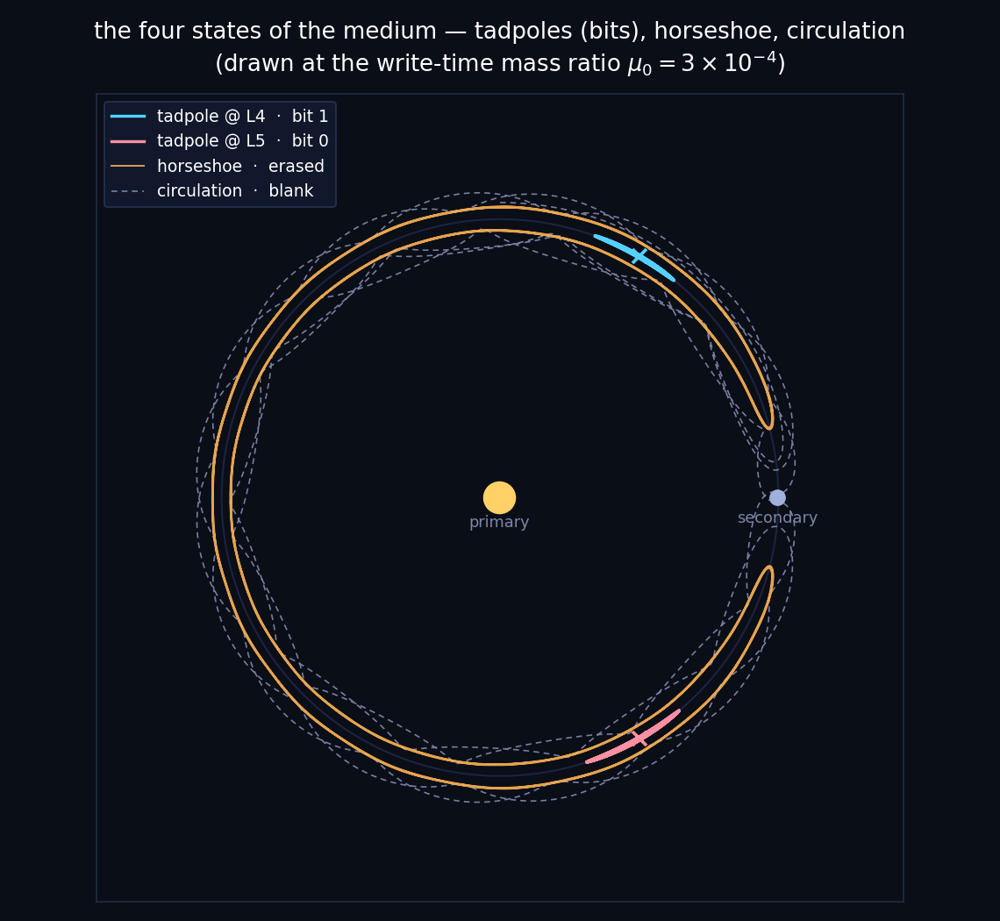
</p>

## Cooling: deeper, harder bits

A freshly placed bit can librate wide. `orbital/cool.py` tightens it the way a real co-orbital spacecraft would — **tangential station-keeping burns**, a few m/s each (capped at `0.008`; the erase threshold is `0.035`). The tadpole is a slow pendulum whose momentum is `da = r − 1`; burns at mid-swing damp it, taking **±62° to under 30° in a couple of burns**:

<p align="center">
  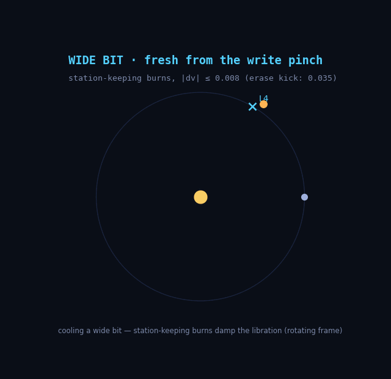
</p>

Getting here took three wrong schemes, kept in the module docstring as physics documentation (retro-kicks eject through the L1 neck; 'raise C_J' is exactly backwards; blind prograde kicks fall out the bottom of the band). The surviving lesson: **C_J stratifies but does not classify** — a cooled, slightly eccentric deep tadpole sits *below* C_L4 while erased orbits sit nearby, so the operational tests (amplitude, readback, honest-engine hold) carry the correctness, not the Jacobi value. A deep bit is also a **harder** bit: farther from every separatrix, it takes a closer flyby to erase.

## The gate, and rewriting by flyby

The unification of the two projects: slingshot-computing's mechanism — an aimed flyby, its launch direction root-found on the full simulation — pointed at this project's stored bit. A massive bullet (`m = 2e-4`) on a fast hyperbolic pass shaves the moonlet at closest approach `0.002`:

<p align="center">
  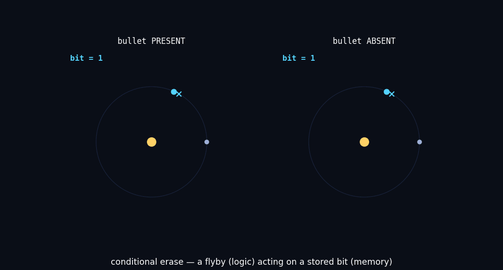
</p>

**Bullet present → bit erased. Bullet absent → bit survives. A graze at 25× the distance → bit survives** (locality). The bullet's presence is a logic input; the stored bit is the register. Two findings run it: the **guiding center stores the bit, and only tangential impulse moves it** (a radial pass at miss 0.004 pumps a monster epicycle yet leaves the bit readable), and a massive intruder **drags the system barycenter**, so readout uses a COM-corrected resonant angle.

**Rewrite** is then real, and reliable: **erase the old bit with a flyby, then insert the new one** — `gate.rewrite_cycle("1", "0")` reads back `0`. Both halves are individually tested, so the cell is genuinely rewritable. The tempting one-shot — a single flyby that *flips* L4→L5 — turns out to be impossible: sweeping the pass depth, the bit's amplitude pumps but stays in its own island until, past a threshold, it erases outright; no depth lands it in the other island (a pinned finding). One conservative impulse can knock the guiding center out of a tadpole, but not settle it into the opposite one.

## Eccentric orbits: a breathing bit

Real planets are eccentric — Jupiter's is `e ≈ 0.0489`. In the elliptic restricted problem the primaries breathe in and out once per year (the equilateral point is a central configuration, so L4 is a fixed linear image of the star→planet vector, seeded exactly). The bit survives, its libration modulating at the orbital frequency while the separation breathes exactly `1 ± e` (test-enforced). There is no exact Jacobi integral here, so the tests assert the honest invariants — retention and bounded, orbit-locked breathing — not a conserved scalar.

## Saturn: the onset of erosion

Add real Saturn as a fourth body (real mass ratio, real 1.84× spacing) and it periodically tugs the Trojan — the mechanism that sculpts the real swarm. Full erosion is a **Gyr** process (secular resonances), far beyond a feasible run; what a short integration shows is its *onset*, and that is all the panels claim:

<p align="center">
  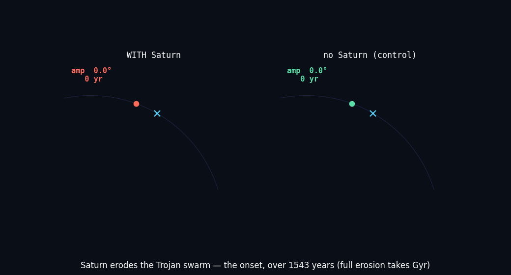
</p>

With Saturn the libration amplitude pumps to ~2× the Saturn-free control over the run (a relative, platform-invariant assertion; the exact figure is chaotic).

## Where a bit survives

The triangular points are linearly stable only for `μ < 0.0385` (the Gascheau/Routh limit); beyond it L4/L5 come apart. Sweep `(μ, amplitude)` and integrate each cell to see where a bit lives — every real co-orbital sits far on the stable side:

<p align="center">
  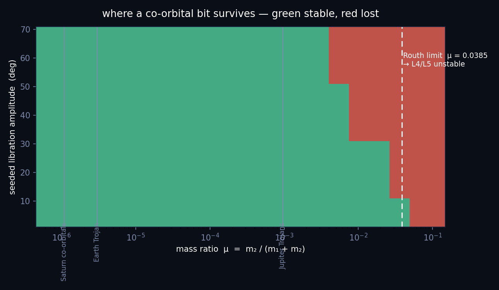
</p>

## The analytic backbone — deriving what we measure

Averaging the restricted problem over the fast orbital period reduces the tadpole to a single degree of freedom: the guiding center in the resonant angle `φ`, in an effective potential set by one shape, `f(φ) = cos φ − 1/(2 sin(φ/2))` (`orbital/hamiltonian.py`). It has equilibria exactly at L4/L5 (60°) and L3 (180°, the separatrix), an L4→L3 barrier of exactly `3μ`, and `f''(60°) = −9/4` — giving the small-amplitude frequency `ω² = (27/4)μ`. From it, closed forms fall out and are **checked against the full n-body sim, not fit to it**:

- **Libration period** vs amplitude — matches the simulated period to **~1.5% across the whole tadpole range** (2°→60°).
- **Separatrix amplitude ≈ 78°** (mass-ratio-independent) — the widest tadpole before it becomes a horseshoe.
- **Noise margin** — the tangential Δv that lifts a bit over the L3 barrier *derives* the empirical `ERASE_KICK = 0.035` to leading order (analytic 0.045; the sim erases ~30% easier via conjunction-side encounters the averaging can't see — a real, documented limit).

<p align="center">
  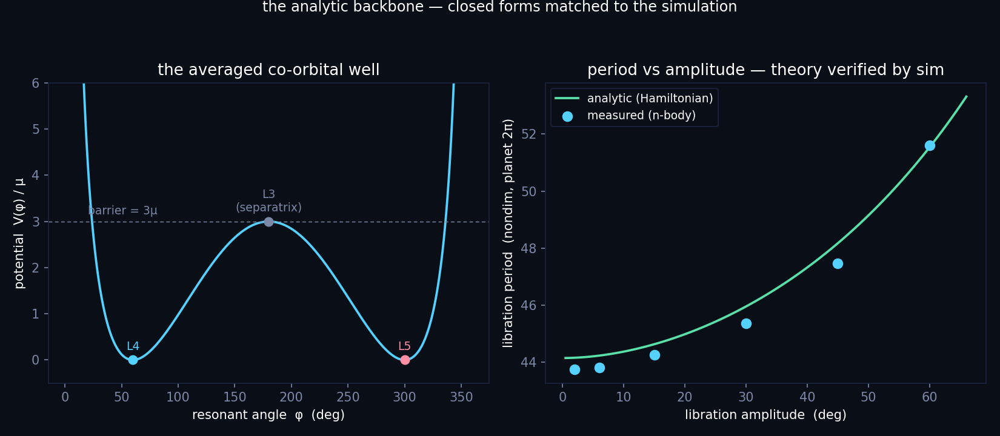
</p>

The sim, in other words, is now the *verifier* of a theory rather than the design tool.

## How long does a bit last?

Not forever — and the datasheet says so. Deep, low-amplitude bits are Nekhoroshev-stable, censored survivors of any feasible integration; as the amplitude climbs toward the L3 separatrix the escape time collapses. Real Jupiter Trojans are metastable at 10 kyr–100 Myr (Greenstreet et al. 2024). Only the escape band is integrated; the deep regime's far-longer lifetime is labeled theory, never a Myr number we didn't run:

<p align="center">
  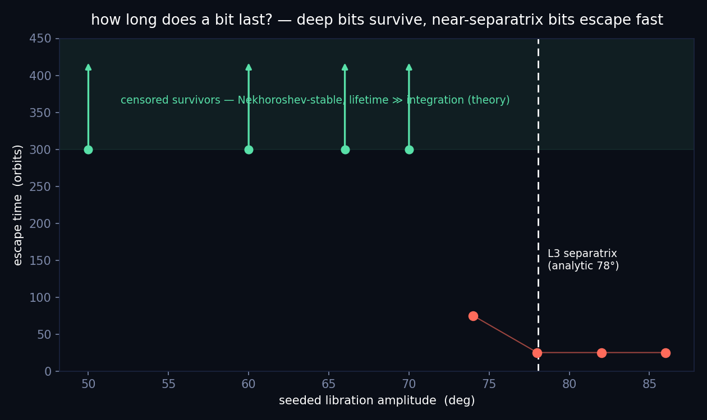
</p>

## A register: more than one bit

A single planet has one L4/L5, so N bits need N hosts — exactly like Saturn's moons, each with its own co-orbital Trojan. A central star carries several light secondaries at spaced radii; each secondary's Trojan is a bit (L4 = 1, L5 = 0). A **nibble round-trips** (`write "1101" → read "1101"`), read in the honest inertial engine. Capacity is bounded by mutual (Hill) stability — pack the hosts closer than ~1.7× and the register goes chaotic; wider, and crosstalk is a few degrees:

<p align="center">
  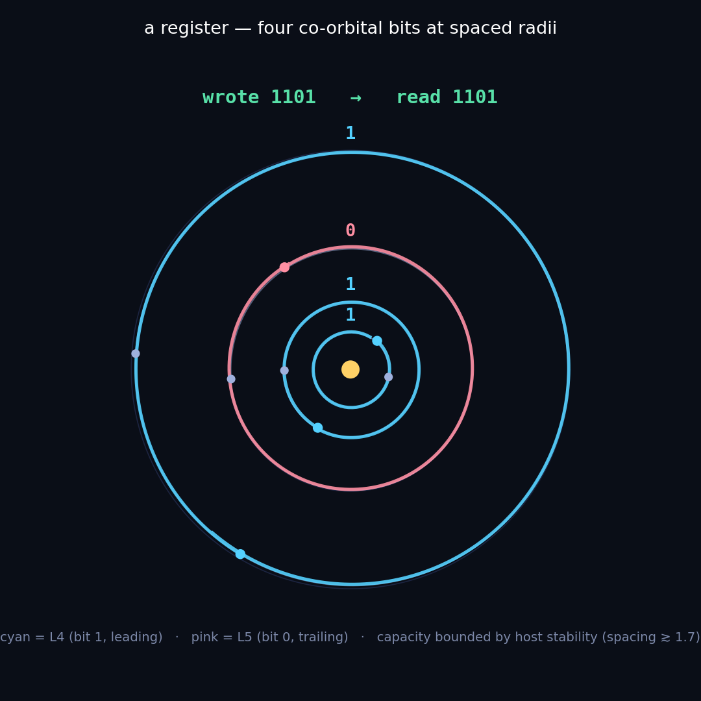
</p>

## The energy landscape

<p align="center">
  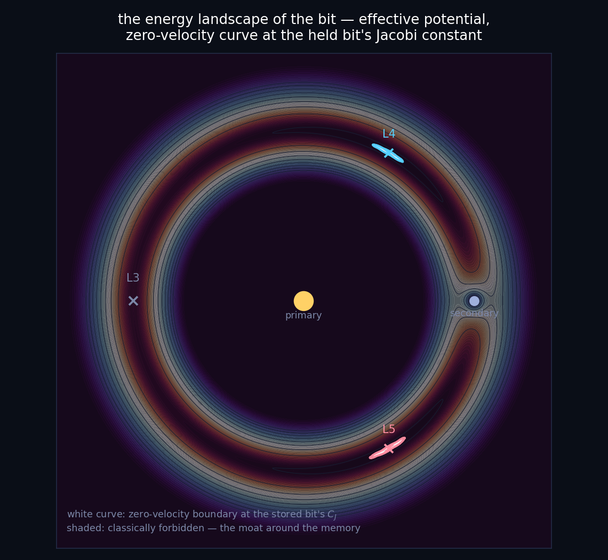
</p>

The rigorous backbone (circular case) is the **Jacobi constant** `C_J`. A held bit sits at the exact triangular value `C_L4 = 3 − μ(1−μ)` (sim matches to 2e-4; no secular drift, test-enforced); a kick lowers `C_J` toward the separatrix; past it, the bit erases. The noise margin — kicks below `memory.ERASE_KICK` = **3.5% of orbital speed** — is a named constant, a statement about `C_J`, and tested on both sides. Because the moonlet is massless, `C_J` — not the system energy, which only sees the massive bodies — is the correct accuracy metric for the cell.

<p align="center">
  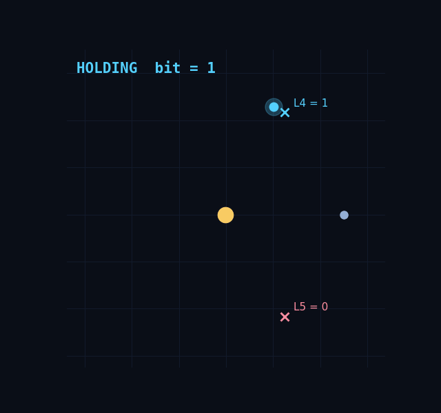
</p>

## 3D

`orbital/nbody.py` infers its dimension from the bodies, so the same integrator runs the flat cell and an **inclined** Trojan (`demos/flipflop_3d.py`) that holds its bit while bobbing ±0.16 through the orbital plane once per orbit — genuinely three-dimensional storage, with the full 3D Jacobi integral conserved to 1e-9 (test-enforced):

<p align="center">
  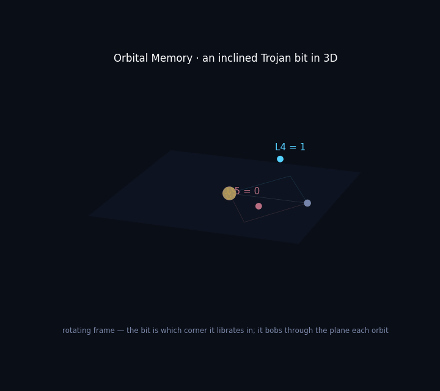
</p>

## Run it

```bash
pip install -r requirements.txt

python -m demos.validation       # the money figure: sim vs observed 148-yr Trojan period
python -m demos.insert_demo      # WRITE: orbit insertion (Δv in m/s)
python -m demos.swarm            # the real Greek & Trojan clouds
python -m demos.phase_portrait   # tadpoles / horseshoe / circulation
python -m demos.stability_map    # where a bit survives (Routh limit + real objects)
python -m demos.gate_demo        # conditional erase by aimed flyby
python -m demos.cool_demo        # station-keeping burns tighten a bit
python -m demos.saturn_erosion   # Saturn pumping the Trojan (the onset)
python -m demos.hamiltonian      # the analytic backbone: theory vs measured
python -m demos.retention        # how long a bit lasts vs amplitude
python -m demos.register         # a nibble in four co-orbital cells
python -m demos.landscape        # the energy-landscape & anatomy figures
python -m demos.flipflop_3d      # the inclined-Trojan 3D gif
python -m demos.make_gifs        # the 2D hold->erase gif
python -m pytest                 # 161-test suite
```

## Tests (TDD, physics-validated)

**161 tests** check the simulation against closed-form theory *and against real observations*, not just against itself:

- **Validation against the sky** — at the real Sun–Jupiter ratio the simulated libration period converts to **~148 years** (the observed Trojan value), matches linear theory, and the bit is stable with no secular drift; the Earth-Trojan case is documented as the honest harder case (linear theory underestimates 2010 TK7's large-amplitude libration).
- **Real units** — `orbital/units.py` reproduces Jupiter's 11.86-yr period and 13.06 km/s orbital speed; round-trip conversions exact.
- **Kepler & conservation** — circular stays circular, Kepler's third law; energy/momentum in 2D & 3D; barycenter pinned; massless moonlet exerts no back-reaction; time-reversal retraces.
- **Lagrange & Jacobi** — L4/L5 exactly equilateral; measured libration period matches `2π/√(27/4·μ)`; `C_J` conserved along held and erased orbits; held bit at analytic `C_L4`; erasing kicks provably lower `C_J`.
- **WRITE (insertion)** — insert '1'→L4, '0'→L5; achieved amplitude matches request; insertion Δv finite and in a plausible m/s range; deterministic; survives a 45-orbit hold with no secular drift.
- **REWRITE / GATE** — `rewrite_cycle` reads back the new bit both directions; aim converges; present erases / absent survives / 25× graze survives; COM-corrected readout provably differs; the single-flyby "flip" boundary is pinned (never reaches the other island).
- **COOL** — burns shrink a wide bit below target with the value preserved; bounded ≪ threshold; survives the honest engine; deterministic.
- **Eccentric** — reduces to circular at e=0; the bit survives real Jupiter eccentricity at L4 and L5; separation breathes exactly `1 ± e` at the orbital frequency.
- **Saturn perturber** (slow) — Saturn measurably pumps the Trojan vs a Saturn-free control (relative, platform-invariant).
- **Analytic backbone** — the averaged Hamiltonian's period matches the sim to ~1.5% across amplitudes; the separatrix (~78°) brackets the sim's tadpole→horseshoe transition; the derived noise margin lands within ~30% of the measured `ERASE_KICK`.
- **Retention** — a deep bit is a censored survivor; near-separatrix bits escape sooner as amplitude rises (in the escape-observable band).
- **Register** — a nibble round-trips (`write→read`); too-close hosts go chaotic while safe spacing stays low-crosstalk; momentum is zeroed and geometry is exact.
- **Memory reader** — the separatrix-crossing classifier handles tadpole/horseshoe/circulation physically, wide tadpoles included; drag destabilization is a committed test.

## Layout

```
orbital/    nbody.py (2D/3D inertial) · rotating.py (co-rotating frame, analysis)
            memory.py (cell, reader, kicks, eccentric, Saturn) · units.py (real units)
            write.py (orbit insertion) · cool.py (station-keeping) · gate.py (flyby + rewrite)
            hamiltonian.py (averaged 1-DOF) · retention.py (lifetimes) · register.py (multi-bit)
            theory.py (C_J, Lagrange points)
demos/      validation · insert_demo · swarm · phase_portrait · stability_map · hamiltonian
            retention · register · gate_demo · cool_demo · saturn_erosion · landscape
            flipflop_3d · make_gifs · flipflop_demo · style.py (shared visual system)
tests/      161 tests: real-sky validation, physics invariants, every operation
docs/       all figures and GIFs above
```

## Physics & numerics

- Circular restricted three-body problem, canonical units (`G = 1`, total mass 1, separation 1, mean motion `n = 1`); a thin units layer rescales to real kg / AU / years / m·s⁻¹. Cell mass ratio `μ = 0.003` for the fast demos (< 0.0385 Gascheau/Routh limit); validation runs at the real `μ = 9.54e-4`.
- Adaptive high-order Runge–Kutta (scipy `DOP853`), no softening; Jacobi drift ~`1e-12` on held cells. Retention numbers are integrated where feasible and theory-extrapolated (Nekhoroshev) beyond, labeled as such; a symplectic integrator (e.g. REBOUND's WHFast) is the right upgrade for genuine Myr–Gyr retention runs.

## Honest caveats & prior art

- **This memory is metastable, not eternal.** Deep, low-amplitude bits are Nekhoroshev-stable (exponentially long-lived), but real Jupiter Trojans are captured and scattered out on 10 kyr–100 Myr timescales (Greenstreet et al., *"Jupiter's Metastable Companions"*, ApJL 2024; Karlsson, A&A 2004: tadpole→horseshoe→ejection). "Long-lived," not "non-volatile."
- **Computing with gravity is an established field, and this project's *logic* framing has direct ancestors.** The flyby gate (in the sibling repo) is a gravitational instance of the Fredkin–Toffoli billiard-ball computer (Fredkin & Toffoli, *Conservative Logic*, 1982) — and **Svozil 2007** (arXiv:physics/0703031) already drew a Fredkin gate from attractive 1/r potentials. Newtonian *n*-body dynamics is known to embed universal computation (Warren Smith 2006; Moore 1990; Yao, JACM 2003), resting on non-collision singularities (Xia 1988/1992). Caveat: that universality lives in the Newtonian point-mass idealization — relativistic constraints (speed capped at *c*) restore ordinary Turing-simulability (Smith 2006), so "gravity hypercomputes" is an idealization artifact, not a physical claim.
- **What appears genuinely novel** (medium confidence — absence of prior art is hard to prove): storing a bit in *which* triangular point (L4 vs L5) a body librates in — a librational/resonance-state memory — and the conditional-erase-by-flyby. Surveyed prior art encodes bits as presence/absence of a moving ball or trajectory topology; none store information in libration state. This is a small step toward Yao's open problem (a *realistic finite-size* gravitational computer).
- The physics is textbook (triangular Lagrange stability — Gascheau/Routh; tadpole/horseshoe co-orbitals — Janus & Epimetheus; the elliptic-restricted equilateral solution; Jacobi integral; the averaged co-orbital Hamiltonian — Nesvorný et al. 2002, Murray & Dermott; observed Trojan libration T₂ = 147.8 yr — Érdi, MNRAS 384:1165). The novelty is the *construction* — a memory cell with an insertion write, a station-keeping cool, a flyby rewrite, a closed-form noise margin, a register, and a real-sky validation.
- Nobody will build this out of asteroids — it is a simulation, validated against real dynamics, not a device. That's the whole conceit, stated plainly.

## Roadmap

- [x] A bit that holds: L4/L5 tadpole memory (80–300 orbits, no drift)
- [x] Noise margin: `ERASE_KICK` = 3.5% of orbital speed, tested both sides
- [x] 3D: dimension-agnostic integrator + inclined-Trojan bit (full 3D Jacobi integral)
- [x] Finding: memory is topological, not dissipative (drag destabilizes L4/L5 — tested)
- [x] **Real units + validation: the simulated bit librates at the observed ~148-yr Trojan period**
- [x] **WRITE by orbit insertion — a real Δv, no grown planet**
- [x] **COOL: honest station-keeping burns**
- [x] **REWRITE by real physics: erase-by-flyby then re-insert (single-flyby flip pinned impossible)**
- [x] **GATE: conditional erase by aimed flyby — logic acts on memory (the capstone)**
- [x] **Eccentric (elliptic restricted) orbits — a breathing bit survives real Jupiter eccentricity**
- [x] **Real Saturn perturber — the onset of swarm erosion**
- [x] **Averaged 1-DOF Hamiltonian — closed-form period, separatrix & noise margin (derives `ERASE_KICK`), matched to the sim**
- [x] **Retention datasheet — bit lifetime vs amplitude, honest metastable framing (integrated + Nekhoroshev-extrapolated)**
- [x] **A register — several co-orbital cells at spaced radii; a nibble round-trips, crosstalk vs spacing (capacity is stability-bounded)**
- [x] **Prior-art truth: cite Svozil/Smith/Yao/Xia (logic) and Greenstreet/Karlsson/Érdi (physics); metastable, not "non-volatile"**
- [x] CI; physics-and-observation-validated suite; findings pinned as tests
- [ ] Dual-rail write head: two moonlets, a routed bullet erases one — the surviving rail IS the written bit (locality datum already tested)
- [ ] Symplectic integrator (REBOUND/WHFast) for genuine Myr–Gyr retention runs
```
